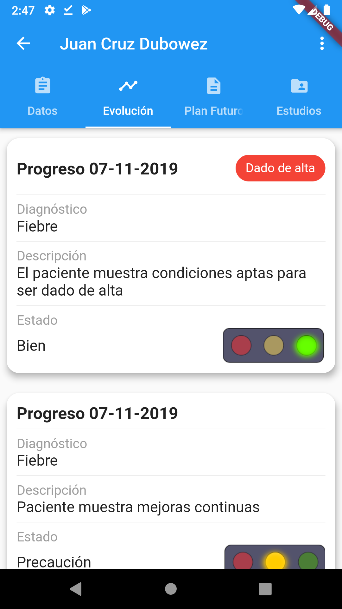

#    Datient Mobile App

## Que es Datient?

> Datient es un sistema para el area de internado del hospital Domingo Funes (ubicado en Santa Maria de Punilla, Córdoba) realizado como proyecto final para la asignatura Formacion para el Ambiente y el Trabajo de 7mo año del Instituto Técnico Salesiano Villada.

## Capturas de pantallas

Inicio de Sesión            |  Registro 
:-------------------------:|:-------------------------:
  |   

NavBar           |  Estadistica
:-------------------------:|:-------------------------:
  |  

Salas            |  Pacientes
:-------------------------:|:-------------------------:
  |  

Información del paciente            |  Evolución del paciente
:-------------------------:|:-------------------------:
  |  

Planes a futuro del paciente            |  Estudios complementarios del paciente
:-------------------------:|:-------------------------:
  |  

 Información de la hospitalización          |  Progreso de la hospitalización
:-------------------------:|:-------------------------:
  |  

## Tecnologías utilizadas

| Tecnología | Descripción |
| ----------- | ----------- |
| Flutter | Framework de Dart para creación de aplicaciones moviles |
| Dart | Lenguaje |
| fl_chart | Gráficos en Flutter |

## Contacto
*teamdatient@gmail.com*